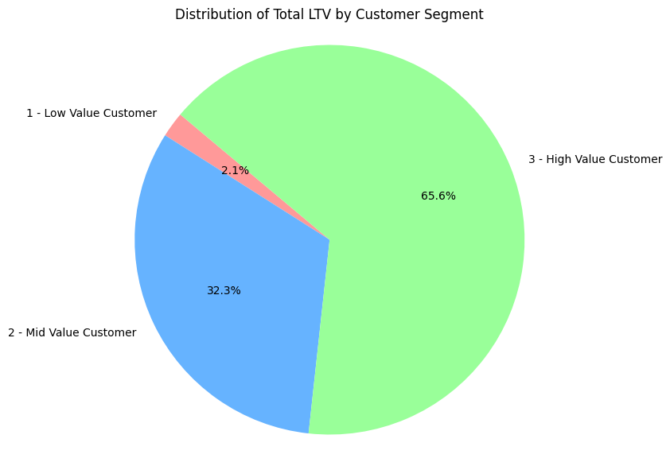
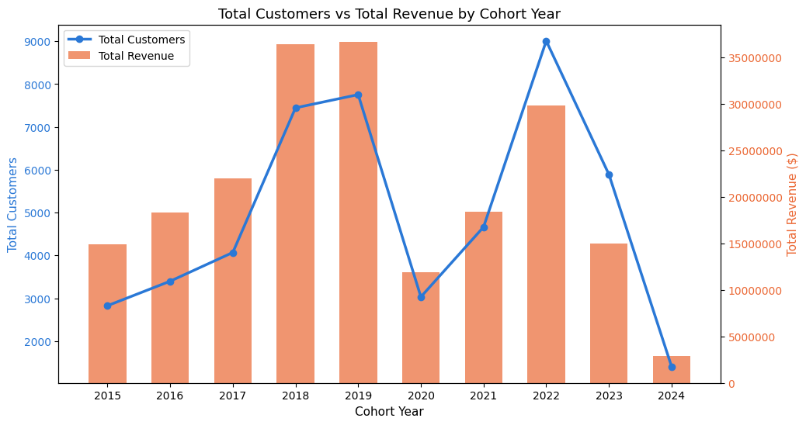
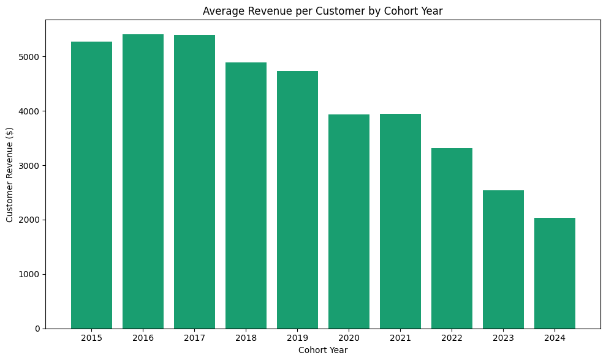
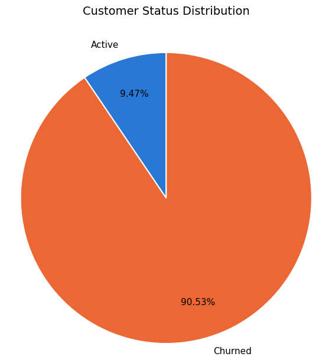
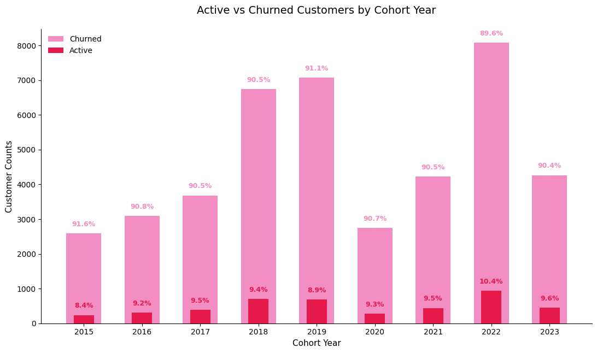
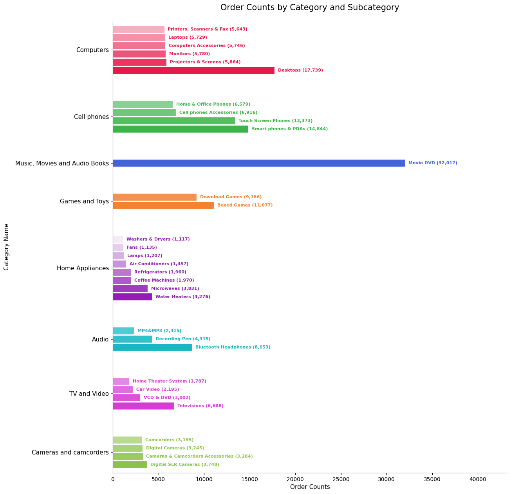

# SQL for Business Revenue Analysis

## 🔎 Overview
Contoso is a fictional e-commerce global electronics retailer with stores across multiple countries, thousands of customers, and a catalog of products sold in different currencies. This project digs into ~100K rows of transactional data to answer the questions which are specified in below section.

Download the database here [Contoso_100k](https://github.com/lukebarousse/Int_SQL_Data_Analytics_Course/releases/download/v.0.0.0/contoso_100k.sql)

## 🛠️ Tools I Use
1️⃣ PostgreSQL ➜ Core programming language to query the database and answer the questions <br>
2️⃣ pgAdmin ➜ Act as PostgreSQL database <br>
3️⃣ Visual Studio Code ➜ Writing the README.md and integration with GitHub <br>
4️⃣ DBeaver ➜ Database admin tool which I mostly use to write the queries on <br>
5️⃣ GitHub ➜ Project's version control and host <br>
6️⃣ Python (Pandas) ➜ Create bar / chart / graph visualization <br>
7️⃣ Google Colab ➜ Environment to run Python in <br>
8️⃣ Claude AI Chatbot ➜ Automation tool to put the values of the table into Pandas Dataframe

## 💼 Business Questions
1️⃣ Who are the most valuable customers? <br>
2️⃣ How does each customer group generate revenue each year? Recent purchase or long-lasting purchase? <br>
3️⃣ Who don't purchase recently?

## 📊 Analysis Approach

### 1. Customer Segmentation
Group customers to 3 categories: High value (Above 75% percentile of total revenue), Mid value (Between 25% and 75% percentile), and low value (below 25% percentile)

**💻 Query**: [1_customer_segmentation.sql](/project_sql/1_customer_segmentation.sql)

**🖼️ Visualization**
|      Customer Value     | Customer Count | Total Lifetime Value ($) | Average Lifetime Value ($) |
| ----------------------- | -------------- | ------------------------ | -------------------------- |
| 1 - Low Value Customer  |      12372     |       4,341,809.53       |            350.94          |
| 2 - Mid Value Customer  |      24743     |       66,636,451.79      |            2693.14         |
| 3 - High Value Customer |      12372     |       135,429,277.27     |            10946.43        |



**🗝️ Key Findings**
- High-value segment (12372 customers ≈ 25% total customers) drives approximately 66% of the total revenue
- Mid-value segment (24743 customers ≈ 50% total customers) generates approximately 32% of the total revenue and holds the highest headcount
- Low-value segment (12372 customers ≈ 25% total customers) drives only 2% of the total revenue

**💡 Business Insights**
- High-Value Customers → **Revenue Engine** <br>
➢ A single customer contribute almost $11,000 to the total revenue, losing one customer proves to be a huge loss. <br>
➢ Prioritize retention over acquisition. <br>
➢ Provide premium perks only available to this segment (early access to new products/features).<br>
➢ Gather information about what makes this customer segment spend this massive cost to absorb more of these customers type

- Mid-Value Customers → **Highest Headcount** <br>
➢ Prioritize deepening relationship. <br>
➢ Provide tiered achievement or tiered benefits (e.g. spend $100 more to unlock reward X). <br>

- Low-Value Customers → **Minimum Contributor** <br>
➢ Keep this segment engaged only by using automated ads or automated engagement. It is best advised not to spend too much manual effort or personal touch or resource into this segment

### 2. Cohort Analysis
Before answering the business question, I already created a ```VIEW``` which joins two tables which are sales and customer and also displays the cohort year (the first year specific customer joined or purchased things).

See the ```VIEW``` query here ➜ [VIEW - Cohort Analysis](/project_sql/VIEW_cohort_analysis.sql)

**💻 Query**: [2_cohort_analysis.sql](/project_sql/2_cohort_analysis.sql)

**🖼️ Visualization**





**🗝️ Key Findings**
- On earlier cohort year, the graph of revenue is relatively higher to the count of customers than the recent years. This indicates that customers from earlier cohorts have spent more per person over their lifetime, of course because they have simply more time to spend on the market than the recently joined customers. <br>
- Taking a closer look at 2021 and 2022: 2022 has 9010 customers and 2021 has 4663 customers (~93% more customers), yet as seen in Graph 2, the revenue per customer instead drops down. Since these two cohorts have similar tenure, this points to a real decline in customer value, suggesting that growth in customer acquisition came at the cost of customer quality.

**💡 Business Insights**
- If the company mission is to reach more r evenue overall, it's better to shift some of the budgets from pure volume metric (customers headcount) to revenue metric or value-based metric.
- Prioritize customer retention first rather than customer acquisition. It seems that earlier cohort customers have a higher average lifetime value than the recent cohorts.
- Study what makes the average customer revenue drops down each year from 2019 (excluding 2020 and 2021 because of the pandemic)

### 3. Customer Status (Active or Churned)
ℹ️ **Definition** <br>

Here, I split the customer status into 2 parts: active vs churned. This is a common term used in the industry. I define churned customers as the one who have not purchased anything for the last 6 months. Why 6 months? I estimate only the rough calculation based on the product category (see the table below)

|            Category           |
| ----------------------------- |
|   Audio                       |
|   Cellphones                  |
|   TV and Video                |
|   Cameras & Camcorders        |
|   Home Appliances             |
|   Games and Toys              |
|   Music, Movies, Audio Books  |
|   Computers                   |

It seems probable to say that customers who don't purchase the products above from Contoso again after their last purchase have moved on to another e-commerce retail.

**💻 Query**: [3_customers_status.sql](/project_sql/3_customers_status.sql)

**🖼️ Visualization**





**🗝️ Key Findings**
- Churn rate is unexpectedly stable across cohorts (89.6% – 91.6%), regardless of customer counts or age. Whether the small 2015 cohort (2,825 customers) or the massive 2022 cohort (9,010 customers), roughly 9 in 10 customers end up "Churned" under this 6-month-inactivity definition
- The stable churn vs active ratio seems to indicate that there is indeed a problem with the definition of churn period, therefore another churn period test must be conducted.

**💡 Business Insights**
- Since ~90% churn shows up identically across every cohort regardless of size or age, It's more likely that Contoso has a naturally long gap between purchases (people don't rebuy electronic products in 6 months), and the current churn period definition mislabels normal customers as churned.

> 🚨 Need to further calibrate the churn period

- Try providing seasonal huge discounts or offers (every 2-3 months) to re-engage the churned customers

### Bonus

**💻 Query**: [bonus_most_popular_products.sql](/project_sql/bonus_most_popular_products.sql)

**🖼️ Visualization**

